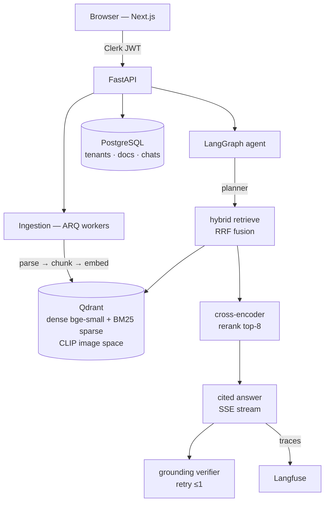

# Corpora — Multi-Tenant Multimodal Agentic RAG Platform

Upload any knowledge — PDFs, DOCX, Markdown, URLs, images — and chat with an
agentic pipeline that plans queries, retrieves with hybrid vector search,
reranks with a cross-encoder, and streams answers with inline citations.
Images are searchable by description via CLIP text-to-image embeddings.
Retrieval quality is **measured in CI**, not assumed.

**Stack**: FastAPI · LangGraph · Qdrant (hybrid dense+sparse) · FastEmbed ·
CLIP text-to-image search · Groq (Llama 3.3 70B) · ARQ + Redis · PostgreSQL ·
Next.js 16 · Clerk auth · Langfuse

## Architecture



### Agent graph

`planner` decomposes the question into 1-3 search queries → `retrieve` runs
hybrid search per query (dense + BM25, fused with Reciprocal Rank Fusion,
deduped) → `rerank` scores candidates with a cross-encoder and keeps top-8 →
`answer` streams a response citing sources inline `[n]` → `verify` judges
grounding and triggers one stricter retry if unsupported claims slip in.

## Quality gate (CI)

Every push runs a golden-dataset eval ([eval/golden.json](eval/golden.json))
through the full pipeline — ingest → agent → judge:

| Metric | How | Gate | Current |
|--------|-----|------|---------|
| Retrieval hit-rate | expected fact present in retrieved chunks (deterministic) | ≥ 0.80 | **1.00** |
| Faithfulness | LLM judge: answer supported by context | ≥ 0.70 | **1.00** |
| Answer relevancy | LLM judge: answer addresses question | ≥ 0.70 | **1.00** |

## Performance (Locust, 20 concurrent users, 60s, local stack, single uvicorn worker, M-series MacBook Air)

| Endpoint | p50 | p95 | p99 | Requests | Failures |
|----------|-----|-----|-----|----------|----------|
| Hybrid search (embed + Qdrant RRF) | 18 ms | 31 ms | 44 ms | 365 | 0 |
| List collections (Postgres) | 7 ms | 25 ms | 37 ms | 275 | 0 |
| List documents | 8 ms | 23 ms | 39 ms | 185 | 0 |
| Health | 2 ms | 5 ms | 14 ms | 83 | 0 |

908 total requests, 0 failures, 15.8 req/s sustained.
Reproduce: `uv run locust -f tests/locustfile.py --host http://localhost:8000 --headless -u 20 -r 5 -t 60s`

## Auth

Clerk end to end: the Next.js app gates all pages behind sign-in and attaches
the session JWT to every API call; the backend verifies RS256 signatures
against Clerk's JWKS and derives the tenant from the token (`org_id`, falling
back to `user_id` — every user gets a private tenant). `AUTH_MODE=dev`
bypasses verification for local development and CI.

## Decision log

- **Hybrid over dense-only** — BM25 sparse catches exact identifiers (error
  codes, prices, names) that dense embeddings blur; RRF fuses without score
  calibration headaches.
- **Cross-encoder rerank** — bi-encoder retrieval optimizes recall; the
  cross-encoder re-scores query+chunk jointly for precision on the top-8 that
  actually enter the prompt.
- **Custom LLM-judge eval instead of RAGAS** — RAGAS fires many judge calls
  per sample; Groq free tier rate-limits made a 2-call/sample judge with the
  same metric semantics (faithfulness, answer relevancy) the pragmatic gate.
- **Verifier fails open** — a broken judge must never block user answers;
  grounding check adds a retry, not a gate.
- **Tenant isolation at the vector layer** — every Qdrant point carries
  `tenant_id` and every query filters on it, so an API-layer bug can't leak
  another tenant's chunks.
- **Assistant messages persist on client disconnect** — SSE generator saves
  accumulated tokens in a cancellation-shielded `finally`.
- **CORS enforced in-app, but HF Spaces' edge proxy injects permissive CORS
  on `*.hf.space`** — verified locally that the middleware blocks foreign
  origins (400); acceptable for a cookie-less demo API, revisit when Clerk
  auth is enforced.

## Run locally

```bash
docker compose up -d                # qdrant + redis + postgres
cp .env.example .env                # add GROQ_API_KEY

cd backend
uv sync
uv run alembic upgrade head
uv run arq app.ingest.worker.WorkerSettings &   # ingestion worker
uv run uvicorn app.main:app --port 8000 &       # API

cd ../frontend
npm install && npm run dev          # http://localhost:3000
```

Tests: `uv run pytest -m "not slow and not eval"` (fast) ·
`-m slow` (e2e ingest+agent) · `-m eval` (quality gate).

## Repo map

```
backend/app/agent/      LangGraph nodes + graph
backend/app/ingest/     parsers, chunking, embeddings, ARQ worker
backend/app/retrieval/  Qdrant hybrid search (RRF), cross-encoder reranker
backend/app/api/        collections, documents, chat (SSE)
frontend/src/           Next.js UI — collections, upload, streaming chat
eval/                   golden dataset + corpus (gate wired into CI)
```
